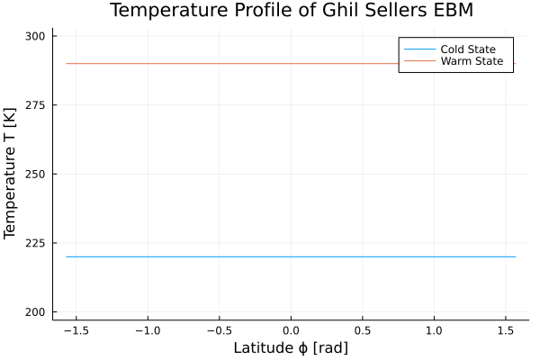

# GhilSellersEBM

[](https://maximilian-gelbrecht.github.io/GhilSellersEBM.jl/dev/)
[](https://github.com/maximilian-gelbrecht/GhilSellersEBM.jl/actions/workflows/CI.yml?query=branch%3Amain)

This package provides an implementation of the Ghil Sellers 1D Energy Balance Model. It is based on three publications: 

* [Sellers: "A Global Climatic Model Based on the Energy Balance of the Earth-Atmosphere System", 1969](https://journals.ametsoc.org/view/journals/apme/8/3/1520-0450_1969_008_0392_agcmbo_2_0_co_2.xml)
* [Ghil: "Climate Stability for a Sellers-Type Model", 1976](https://journals.ametsoc.org/view/journals/atsc/33/1/1520-0469_1976_033_0003_csfast_2_0_co_2.xml)
* [Bodai et al: "Global instability in the Ghil-Sellers model", 2014](https://arxiv.org/abs/1402.3269)
    
The package does not include a solver, it provides everything needed to discretize the PDE and set it up so that it can be solved e.g. with `DifferentialEquations.jl`. The [documentation](https://maximilian-gelbrecht.github.io/GhilSellersEBM.jl/dev/) provides an introduction to the model as well. 
## Example Use 

Solving the model with two initial conditions: one leading to cold and one to a warm state. 

```julia
using GhilSellersEBM, DifferentialEquations, Plots 

x = (-90.:5.:90.)./90.
grid = Grid(x)
p = ContinousGhilSellersParameters(grid);

tspan = (0.,1e8)
prob = ODEProblem(ghilsellers_ebm!, 220*ones(p.g.N), tspan, p)

sol_1 = solve(prob)
sol_2 = solve(remake(prob, u0=290*ones(p.g.N)))

t_plot = range(tspan[1],tspan[2],length=200)
anim = @animate for it ∈ t_plot
    plot(p.ϕ, sol_1(it), xlabel="Latitude ϕ [rad]", label="Cold State", ylims=[210,300], ylabel="Temperature T [K]", title="Temperature Profile of Ghil Sellers EBM")
    plot!(p.ϕ, sol_2(it), label="Warm State", ylims=[200,300])
end 
gif(anim, "ebm-anim.gif", fps=10)
```

